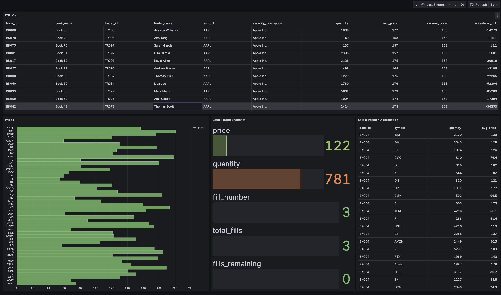

# CelerData BYOC Market Data Demo


This is a demo showcasing StarRocks features within the context of equities market data in a shared nothing data deployment on the CelerData BYOC Free Trial. By the end of this demo setup you will be able to:

- Setup Kafka via Docker run on an EC2 instance
- Ingest data using routine load from Kafka with a market data simulation script into StarRocks hosted on CelerData BYOC
- Ingest data from a static data simulation script into an S3, Iceberg datalake with an AWS Glue metastore into StarRocks hosted on CelerData BYOC
- Generate lightweight insights on portfolio P&L & trade metrics across catalogs with general queries and materialized views
- Chart data on a realtime Grafana Dashboard 


## Prerequisites
- CelerData BYOC free trial or general purpose account
- AWS Cloud Account linked to CelerData BYOC
- Docker and Python 3.7+ installed on a host within the cloud 
- Grafana Cloud or local setup


## Architecture

The general architecture is as follows. We have an external Iceberg catalog via Glue, and we have a stream of data incoming from Kafka. This data is ingested via routine load into StarRocks and then displayed on Grafana.


## Setup

### 1. Create AWS Glue Managed Database and S3 bucket
Ensure that you have created a database within AWS Glue and an S3 bucket thats hosting your Iceberg data. The name of the bucket and database will be referenced in static.py later.

### 2. Validate BYOC Cluster Privileges and Roles
Once you have created a CelerData BYOC account and setup a AWS Glue database and S3 bucket, you must ensure that your FE node (Front End node) has read/write access to AWS Glue to create an external catalog. To ensure this is the case, go to the associated instance profile role that was delegated to your BYOC cluster at launch, and view the privileges given to it. You can view this by going to the AWS management console and clicking:

1. EC2
2. Instances (running)
3. Name of FE Node (CelerDataFEXXXX)
4. Security tab
5. IAM Role

If you do not see any AWS Glue read/write access, you can define your own role and attach it to the machine or simply add an inline policy to the prexisting instance profile role as follows. Ensure to substitute your bucket name that you created previously.

```bash
{
  "Version": "2012-10-17",
  "Statement": [
    {
      "Effect": "Allow",
      "Action": [
        "glue:GetDatabase",
        "glue:GetDatabases",
        "glue:GetTable",
        "glue:GetTables",
        "glue:CreateTable",
        "glue:UpdateTable",
        "glue:DeleteTable",
        "glue:CreateDatabase",
        "glue:UpdateDatabase",
        "glue:DeleteDatabase"
      ],
      "Resource": "*"
    },
    {
      "Effect": "Allow",
      "Action": [
        "s3:PutObject",
        "s3:GetObject",
        "s3:DeleteObject"
      ],
      "Resource": "arn:aws:s3:::<your-bucket-name>/*"
    },
    {
      "Effect": "Allow",
      "Action": "s3:ListBucket",
      "Resource": "arn:aws:s3:::<your-bucket-name>"
    }
  ]
}


```
### 3. Prepare Kafka EC2 host
As mentioned previously, you will need to allocate a host for running Kafka via docker (or using a managed Kafka managed service in AWS). Based on your individual cloud architecture, ensure the security group of your FE and BE nodes allow traffic in and out of the cluster to the Kafka host. Kafka will be situated on port 9092 by default. Similarly, ensure the Kafka host allows traffic in and out from the BYOC cluster.

In addition to validating port level access, the Kafka host should have some sort of instance role or profile that grants read/write capabilities to AWS. Similar to the BYOC cluster, add an inline policy or role incorporating the following rules if needed:

```bash
{
  "Version": "2012-10-17",
  "Statement": [
    {
      "Effect": "Allow",
      "Action": [
        "glue:GetDatabase",
        "glue:GetDatabases",
        "glue:GetTable",
        "glue:GetTables",
        "glue:GetPartition",
        "glue:GetPartitions"
      ],
      "Resource": [
        "arn:aws:glue:us-east-1:<account-id>:catalog",
        "arn:aws:glue:us-east-1:<account-id>:database/<your-db-name>",
        "arn:aws:glue:us-east-1:<account-id>:table/<your-db-name>/*"
      ]
    },
    {
      "Effect": "Allow",
      "Action": [
        "s3:*"
      ],
      "Resource": [
        "arn:aws:s3:::<insert-bucket-name>",
        "arn:aws:s3:::<insert-bucket-name>/*"
      ]
    }
  ]
}

```

### 4. Clone Repository to Kafka Host
Clone repository to the host to access scripts and requirements.txt.

### 5. Start Kafka Container on EC2 host
Replace `YOUR_EC2_IP` with your actual EC2 public IP:

```bash
docker run -d \
  --name kafka-trading-demo \
  -p 9092:9092 \
  -e KAFKA_NODE_ID=1 \
  -e KAFKA_PROCESS_ROLES="broker,controller" \
  -e KAFKA_LISTENERS="PLAINTEXT://0.0.0.0:9092,CONTROLLER://0.0.0.0:9093" \
  -e KAFKA_ADVERTISED_LISTENERS="PLAINTEXT://YOUR_EC2_IP:9092" \
  -e KAFKA_CONTROLLER_LISTENER_NAMES="CONTROLLER" \
  -e KAFKA_LISTENER_SECURITY_PROTOCOL_MAP="CONTROLLER:PLAINTEXT,PLAINTEXT:PLAINTEXT" \
  -e KAFKA_CONTROLLER_QUORUM_VOTERS="1@localhost:9093" \
  -e KAFKA_OFFSETS_TOPIC_REPLICATION_FACTOR=1 \
  -e KAFKA_TRANSACTION_STATE_LOG_REPLICATION_FACTOR=1 \
  -e KAFKA_TRANSACTION_STATE_LOG_MIN_ISR=1 \
  -e KAFKA_GROUP_INITIAL_REBALANCE_DELAY_MS=0 \
  -e KAFKA_NUM_PARTITIONS=1 \
  -e KAFKA_LOG_RETENTION_HOURS=168 \
  apache/kafka:3.7.0
```

### 4. Create Topics
Wait for Kafka to start (10-15 seconds), then create the required topics:

```bash
# Create trades_topic
docker exec -it kafka-trading-demo /opt/kafka/bin/kafka-topics.sh \
  --bootstrap-server localhost:9092 \
  --create \
  --topic trades_topic \
  --partitions 1 \
  --replication-factor 1

# Create prices_topic
docker exec -it kafka-trading-demo  /opt/kafka/bin/kafka-topics.sh \
  --bootstrap-server localhost:9092 \
  --create \
  --topic prices_topic \
  --partitions 1 \
  --replication-factor 1
```

### 5. Install Dependencies
```bash
pip install -r requirements.txt
```
### 6. Edit Script Environment Variables

As mentioned earlier, we need to adapt some of the default environment variables in static.py to the individual databases and buckets that were used. Edit the following lines:

##### static.py
```bash
 os.environ["AWS_REGION"] = <insert-region> # e.g us-east-1
 os.environ["AWS_DEFAULT_REGION"] = <insert-region> # e.g us-east-1
 
 S3_BUCKET = "s3://<insert-bucket-name>/"
 GLUE_DB = "<insert-database-name>"
```

### 7. Run Producers
```bash
python dynamic_producer.py  # this will fill static data once and exit
python static_producer.py # will continously run until max order_id (default 1,000,000)
```

### 8. Run SQL via BYOC Console

Copy and paste the respective setup sql from the text file in this repository into the BYOC console. Before running the SQL ensure you change the S3 and glue region on the external catalog command, and also change the database for all of the external catalog table creations.
```bash
iceberg_catalog_glue.<insert-database-name>.<table-name>
```
It is recommended you run each command one by one to ensure you are running the commands within the correct catalog and database.

This text file contains the necessary routine load ingestion from Iceberg and Kafka, but also the tables and materialized views that will be leveraged on the Grafana frontend. Feel free to query some of the preset tables as per the commented lines at the bottom. 

### 9. Connect to Cluster via Grafana

Since CelerData BYOC and StarRocks leverages native sql connection protocol, we can simply select the MySQL data source on the Grafana UI, and connect to our FE HTTP Port, exposed on FE-NODE-IP:9030. 

After adding a data source, you can import the JSON model defined in the repository by utilizing the import dashboard feature and pasting the model. You should then see a queryable dashboard like below:




## Troubleshooting
- Ensure port 9092 is open in your security group
- Check container status: `docker logs kafka`
- Verify topics: `docker exec kafka kafka-topics.sh --bootstrap-server localhost:9092 --list`
